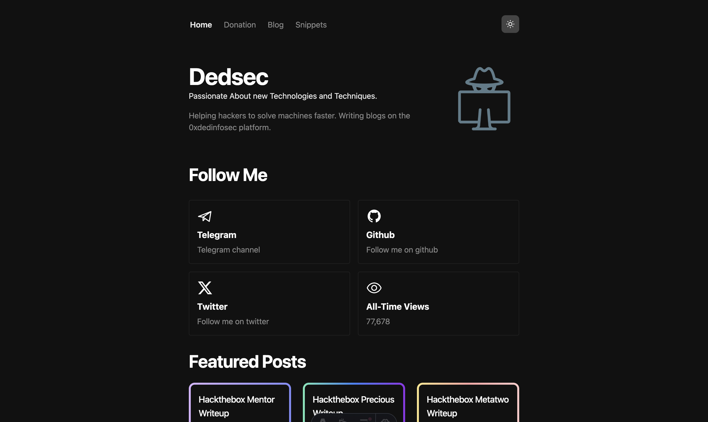

[](https://vercel.com/new/clone?repository-url=https://github.com/0xdedinfosec/0xdedinfosec-astro)

[](https://deploy.workers.cloudflare.com/?url=https://github.com/0xdedinfosec/0xdedinfosec-astro)

# 0xDedinfosec Blogs



-   **Framework**: [Astro](https://astro.build/)
-   **Deployment**: [Vercel](https://vercel.com) & [Cloudflare](https://pages.cloudflare.com/)
-   **Styling**: [Tailwind CSS](https://tailwindcss.com)
-   **Analytics**: [Vercel Analytics](https://vercel.com/analytics) & [Cloudflare Analytics
    ](https://www.cloudflare.com/en-in/application-services/products/analytics/)

# 0xDedinfosec API

> I use Cloudflare Workers to host my API.
> [https://github.com/0xdedinfosec/0xdedinfosec-api](https://github.com/0xdedinfosec/0xdedinfosec-api)

# BuyMeACoffee API

> I'm using Buy Me a Coffee Developer API to gather contributions from users who support me in raising funds for the OSCP exam.

You can obtain the `DONATION_API_SECRET` from https://developers.buymeacoffee.com/#/?id=authentication

# .env

```bash
PUBLIC_API_URL="" # API URL
DONATION_API_SECRET="" # Buy Me a Coffee Developer API Secret
```

# License

Licensed under the [MIT license](https://github.com/0xdedinfosec/0xdedinfosec-astro/blob/main/LICENSE.md).
